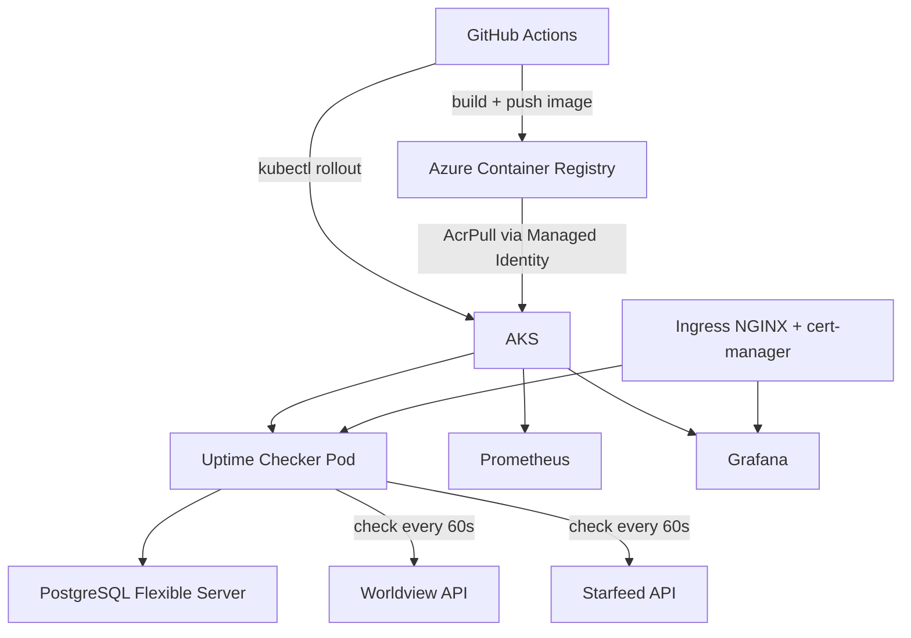
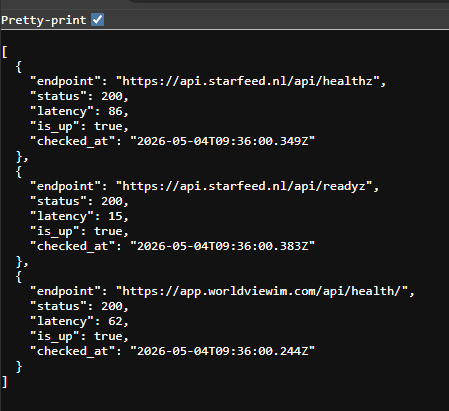

# AKS Platform

Production-grade Kubernetes platform on Azure with full observability, CI/CD, and automated uptime monitoring of live services.

## Stack

| Layer              | Technology                   |
| ------------------ | ---------------------------- |
| Cloud              | Azure                        |
| Kubernetes         | AKS                          |
| Infrastructure     | Terraform (modular)          |
| Container Registry | Azure Container Registry     |
| Package Manager    | Helm                         |
| Monitoring         | Prometheus + Grafana         |
| Database           | PostgreSQL Flexible Server   |
| CI/CD              | GitHub Actions               |
| SSL                | cert-manager + Let's Encrypt |
| Ingress            | NGINX Ingress Controller     |

## Architecture



## Infrastructure

Fully managed via Terraform with modular structure:

- `modules/aks` — AKS cluster with SystemAssigned Managed Identity
- `modules/acr` — Azure Container Registry with AcrPull role assignment
- `modules/database` — PostgreSQL Flexible Server (northeurope)

State stored in Azure Blob Storage. Destroy and rebuild anytime with `terraform apply`.

## Services

### Uptime Checker

Monitors live production endpoints every 60 seconds and stores results in PostgreSQL. Sends Slack alerts when an endpoint goes down.

**Monitored endpoints:**

- `https://app.worldviewim.com/api/health/` — Worldview runtime API
- `https://api.starfeed.nl/api/healthz` — Starfeed API health
- `https://api.starfeed.nl/api/readyz` — Starfeed API readiness

**API endpoints:**

- `GET /api/status` — latest status per endpoint
- `GET /api/history/:endpoint` — last 100 checks for a specific endpoint
- `GET /api/healthz` — health check (used by Kubernetes liveness + readiness probes)

### Live API output



## Monitoring

Prometheus scrapes all pods every 30 seconds. Grafana visualizes cluster metrics, namespace resource usage, and network traffic.

### Cluster Overview


### Namespace Pods (apps)


### Network


### Node Pods


## Deployment

### Prerequisites

- Azure CLI
- Terraform
- kubectl
- Helm

### Spin up the cluster

```bash
cd terraform
terraform init
terraform apply
```

### Connect kubectl

```bash
az aks get-credentials \
  --resource-group rg-aksplatform \
  --name aks-aksplatform \
  --file ~/.kube/config-aksplatform

export KUBECONFIG=~/.kube/config-aksplatform
kubectl get nodes
```

### Deploy namespaces and apps

```bash
kubectl apply -f k8s/namespaces/namespaces.yaml
kubectl apply -f k8s/apps/uptime-checker/configmap.yaml
kubectl apply -f k8s/apps/uptime-checker/deployment.yaml
```

### Deploy monitoring

```bash
helm install prometheus prometheus-community/kube-prometheus-stack \
  --namespace monitoring \
  --values k8s/monitoring/prometheus-values.yaml
```

### Deploy ingress + SSL

```bash
helm install ingress-nginx ingress-nginx/ingress-nginx \
  --namespace ingress-nginx --create-namespace

helm install cert-manager jetstack/cert-manager \
  --namespace cert-manager --create-namespace \
  --set crds.enabled=true

kubectl apply -f k8s/monitoring/cluster-issuer.yaml
kubectl apply -f k8s/monitoring/grafana-ingress.yaml
kubectl apply -f k8s/apps/uptime-checker/ingress.yaml
```

### Local access via port-forward

```bash
# Grafana
kubectl port-forward svc/prometheus-grafana 3001:80 -n monitoring
# open http://localhost:3001  (admin / GrafanaAdmin2026!)

# Uptime checker
kubectl port-forward svc/uptime-checker 3002:80 -n apps
# open http://localhost:3002/api/status
```

### Destroy

```bash
cd terraform
terraform destroy
```

## Security

- Managed Identity for ACR pull — no static credentials anywhere
- Kubernetes Secrets for sensitive config — never committed to Git
- Service Principal scoped to Contributor on subscription only
- PostgreSQL firewall allows Azure services only
- Ingress NGINX as single entry point — pods not directly exposed
- SSL via cert-manager + Let's Encrypt

## Cost

| Resource                     | Cost       |
| ---------------------------- | ---------- |
| AKS (1x Standard_D2s_v6)     | ~€70/month |
| PostgreSQL (B_Standard_B1ms) | ~€15/month |
| ACR (Basic)                  | ~€5/month  |

Cluster is destroyed after use. Total spend covered by Azure free credits ($200).
