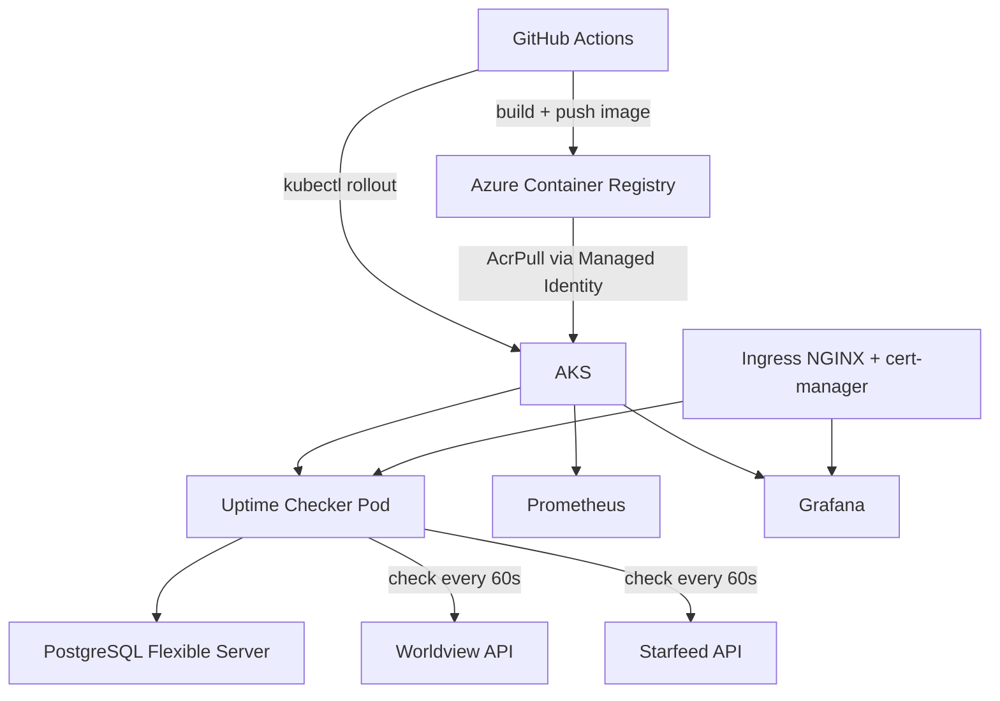
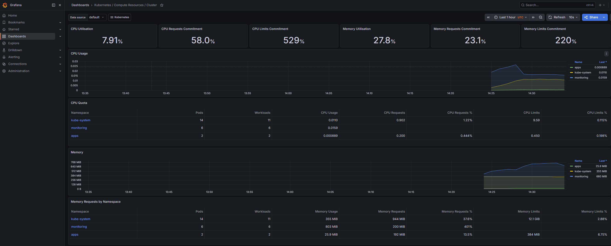
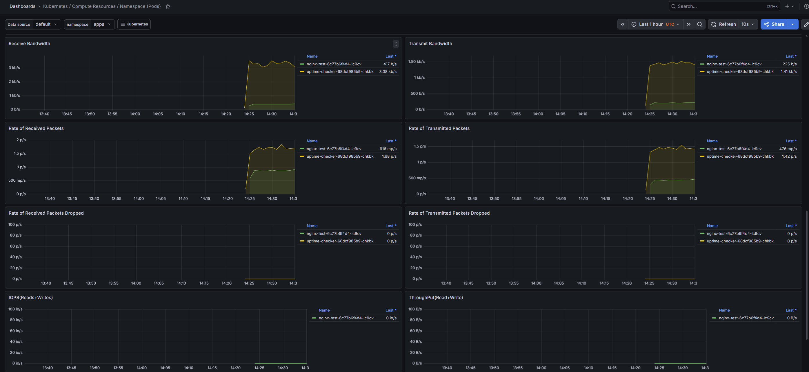
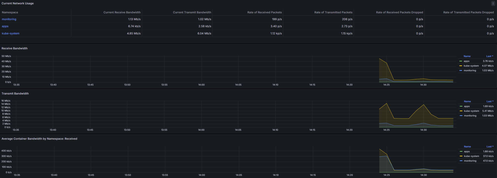
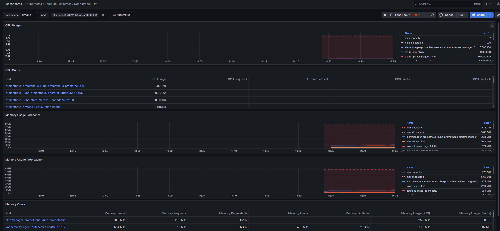

# AKS Platform

Production-grade Kubernetes platform on Azure with full observability, CI/CD, and automated uptime monitoring of live services.

## Stack

| Layer              | Technology                   |
| ------------------ | ---------------------------- |
| Cloud              | Azure                        |
| Kubernetes         | AKS                          |
| Infrastructure     | Terraform (modular)          |
| Container Registry | Azure Container Registry     |
| Package Manager    | Helm                         |
| Monitoring         | Prometheus + Grafana         |
| Database           | PostgreSQL Flexible Server   |
| CI/CD              | GitHub Actions               |
| SSL                | cert-manager + Let's Encrypt |
| Ingress            | NGINX Ingress Controller     |

## Architecture



## Infrastructure

Fully managed via Terraform with modular structure:

- `modules/aks` — AKS cluster with SystemAssigned Managed Identity
- `modules/acr` — Azure Container Registry with AcrPull role assignment
- `modules/database` — PostgreSQL Flexible Server

State stored in Azure Blob Storage.

## Services

### Uptime Checker

Monitors live endpoints every 60 seconds and stores results in PostgreSQL.

**Monitored endpoints:**

- `https://app.worldviewim.com/api/health/`
- `https://api.starfeed.nl/api/healthz`
- `https://api.starfeed.nl/api/readyz`

**API:**

- `GET /api/status` — latest status per endpoint
- `GET /api/history/:endpoint` — last 100 checks for an endpoint
- `GET /api/healthz` — health check

## Monitoring

### Cluster Overview



### Namespace Pods



### Network



### Node Pods



## Deployment

### Prerequisites

- Azure CLI
- Terraform
- kubectl
- Helm

### Infrastructure

```bash
cd terraform
terraform init
terraform apply
```

### Connect to cluster

```bash
az aks get-credentials \
  --resource-group rg-aksplatform \
  --name aks-aksplatform \
  --file ~/.kube/config-aksplatform

export KUBECONFIG=~/.kube/config-aksplatform
```

### Deploy monitoring

```bash
helm install prometheus prometheus-community/kube-prometheus-stack \
  --namespace monitoring \
  --values k8s/monitoring/prometheus-values.yaml
```

### Destroy

```bash
terraform destroy
```

## Security

- Managed Identity for ACR pull — no static credentials
- Secrets via Kubernetes Secrets — never in Git
- Service Principal with Contributor role for Terraform only
- PostgreSQL accessible only from Azure services

## Cost

| Resource                     | Cost       |
| ---------------------------- | ---------- |
| AKS (1x Standard_D2s_v6)     | ~€70/month |
| PostgreSQL (B_Standard_B1ms) | ~€15/month |
| ACR (Basic)                  | ~€5/month  |
| **Azure free credits**       | **$200**   |

Destroy cluster when not in use: `terraform destroy`
